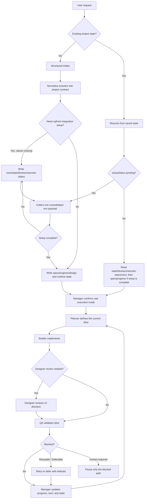
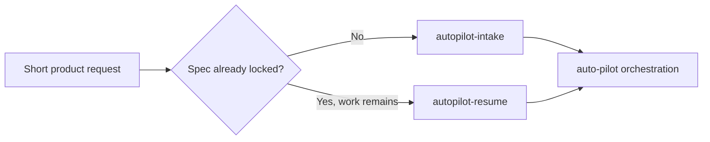
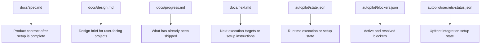

# Auto Pilot How It Works

## At a Glance

Auto Pilot turns a short product request into a repeatable execution loop.

It does four things in order:

1. route the request into intake or resume
2. decide whether upfront integration setup is needed
3. lock the project contract and route the work through planner, builder, designer, and QA checkpoints
4. recover from interruptions by reading saved state

## End-to-End Flow



## Routing Logic



- New requests go through intake first.
- Existing projects resume from `autopilot/state.json`, even if setup is still pending and `docs/spec.md` does not exist yet.
- The public Codex entry point stays `$auto-pilot`.

## Team Model

Auto Pilot uses a manager-led team model.

- `Manager`: owns user interaction and final state updates
- `Planner`: defines the current slice and acceptance criteria
- `Architect`: joins when structure decisions are non-trivial
- `Builder`: implements the current slice
- `Designer`: joins for user-facing UI work
- `QA`: validates the slice before completion

Internal specialist skills back this flow:

- `autopilot-planner`
- `autopilot-architect`
- `autopilot-designer`
- `autopilot-qa`

Manager writes each specialist result back through `scripts/team_checkpoint.py`.

## What Intake Actually Locks

The intake step does not just collect free text. It locks the operating contract for the project.

- product summary
- target user
- core features
- non-goals
- stack preferences
- architecture preset
- auth requirement and provider
- payments requirement
- admin requirement
- theme preset
- visual vibe
- design direction
- deploy target
- data store and provider
- definition of done

These answers become the source of truth for later implementation decisions.

## File Contract



### Files generated once setup is complete

- `docs/spec.md`
- `docs/progress.md`
- `docs/next.md`
- `autopilot/state.json`
- `autopilot/blockers.json`
- `autopilot/secrets-status.json`

### Files generated while setup is still pending

- `docs/next.md`
- `autopilot/state.json`
- `autopilot/blockers.json`
- `autopilot/secrets-status.json`

### Conditional file

- `docs/design.md` for user-facing projects such as landing pages, dashboards, mobile apps, and web apps

## Execution Loop

```mermaid
sequenceDiagram
    participant U as User
    participant A as Manager
    participant P as Planner
    participant B as Builder
    participant D as Designer
    participant Q as QA
    participant S as Saved State
    U->>A: Start or resume project
    A->>S: Read state, blockers, secrets-status, next
    alt setupStatus pending
        A-->>U: Request the missing env payload
    else setup complete
        A->>S: Read spec, progress, and design when relevant
    A->>A: Confirm native specialists or downgrade to serial-fallback
    A->>P: Define the next shippable slice
    P-->>A: Slice plan and quality gates
    A->>B: Implement the slice
    alt User-facing UI slice
        B->>D: Hand off for design review
        D-->>A: Design verdict
    end
    A->>Q: Run QA validation
    Q-->>A: Pass/fail verdict
    A->>S: Write progress, next steps, and state
    alt Human-required blocker
        A->>S: Record blocker with ownerRole
        A-->>U: Ask for smallest missing decision
    else No blocker or safe default
        A->>P: Continue loop
    end
```

The execution loop is intentionally conservative:

- always read runtime state before acting
- manager confirms the real backend before dispatching specialists
- planner goes before builder
- QA goes before completion
- keep going with safe defaults where risk is low
- treat setup pending as a normal pre-execution phase, not as a blocker by itself
- only stop when the definition of done is met or a human-only blocker is unavoidable

## Design Path

For user-facing projects, Auto Pilot adds one extra layer before the first UI build:

1. read `theme_preset`, `visual_vibe`, and `design_direction`
2. create `docs/design.md`
3. use that brief as the active UI direction
4. require one design review pass after the first UI implementation

This is meant to reduce generic SaaS-looking output, not to pretend that every design decision is fully automated.

## Blocker Model

Auto Pilot treats blockers in three buckets, and each blocker should record an `ownerRole`:

- `retryable`: keep trying within the retry budget
- `deferable`: continue with safe defaults and record the follow-up
- `human-required`: pause only the blocked path and ask for the minimum missing input

## Why Resume Works

Resume works because the project is not reconstructed from memory. It is reconstructed from files.

- `autopilot/state.json` tracks runtime context
- `autopilot/secrets-status.json` tracks whether setup is still pending
- `docs/next.md` shows either setup instructions or the next intended slice
- `docs/spec.md` keeps the contract once setup is complete
- `docs/progress.md` shows completed work once implementation has started
- `autopilot/blockers.json` explains what is stopping forward motion

That makes session restarts, long gaps, and interrupted runs much cheaper.
