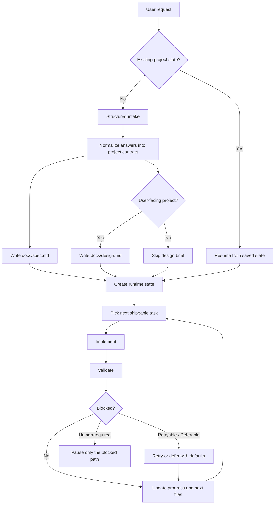
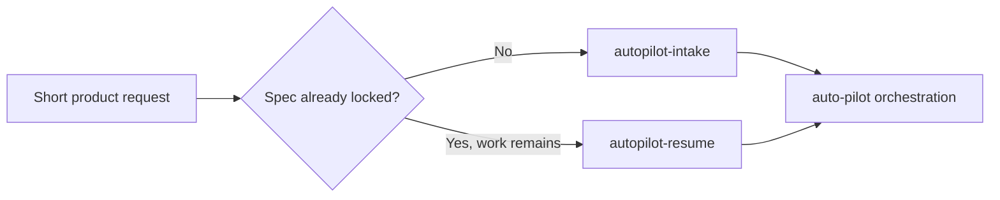
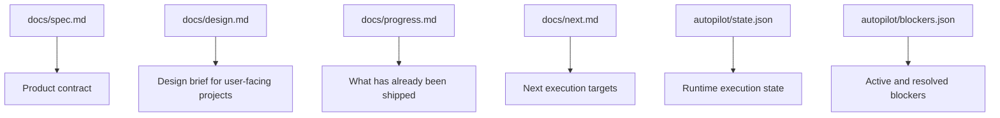
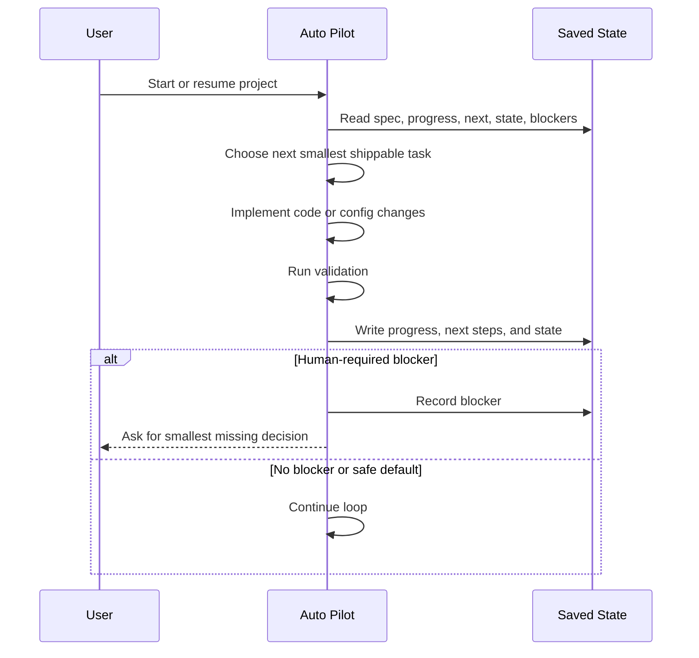

# Auto Pilot How It Works

## At a Glance

Auto Pilot turns a short product request into a repeatable execution loop.

It does four things in order:

1. route the request into intake or resume
2. lock a project contract on disk
3. keep executing the next shippable slice
4. recover from interruptions by reading saved state

## End-to-End Flow

## Routing Logic

- New requests go through intake first.
- Existing projects skip repeated questions and resume from saved files.
- The public Codex entry point stays `$auto-pilot`.

## What Intake Actually Locks

The intake step does not just collect free text. It locks the operating contract for the project.

- product summary
- target user
- core features
- non-goals
- stack preferences
- architecture preset
- theme preset
- visual vibe
- design direction
- deploy target
- data store
- definition of done

These answers become the source of truth for later implementation decisions.

## File Contract

### Always-generated files

- `docs/spec.md`
- `docs/progress.md`
- `docs/next.md`
- `autopilot/state.json`
- `autopilot/blockers.json`

### Conditional file

- `docs/design.md` for user-facing projects such as landing pages, dashboards, mobile apps, and web apps

## Execution Loop

The execution loop is intentionally conservative:

- always read state before acting
- prefer the next smallest shippable slice
- keep going with safe defaults where risk is low
- only stop when the definition of done is met or a human-only blocker is unavoidable

## Design Path

For user-facing projects, Auto Pilot adds one extra layer before the first UI build:

1. read `theme_preset`, `visual_vibe`, and `design_direction`
2. create `docs/design.md`
3. use that brief as the active UI direction
4. require one design review pass after the first UI implementation

This is meant to reduce generic SaaS-looking output, not to pretend that every design decision is fully automated.

## Blocker Model

Auto Pilot treats blockers in three buckets:

- `retryable`: keep trying within the retry budget
- `deferable`: continue with safe defaults and record the follow-up
- `human-required`: pause only the blocked path and ask for the minimum missing input

## Why Resume Works

Resume works because the project is not reconstructed from memory. It is reconstructed from files.

- `docs/spec.md` keeps the contract
- `docs/progress.md` shows completed work
- `docs/next.md` shows the next intended slice
- `autopilot/state.json` tracks runtime context
- `autopilot/blockers.json` explains what is stopping forward motion

That makes session restarts, long gaps, and interrupted runs much cheaper.
